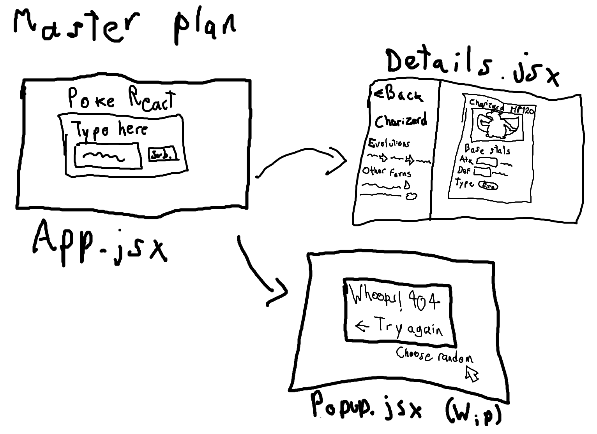

# Welcome to my React training with the Pokémon API

I took it upon myself to grab the [Pokémon API](https://pokeapi.co/) and use it to flex my React muscles, **at the moment of writing this README** it is still very much barebones, pretty much the only thing you can do is type in the name of a Pokémon and it basically tells you "Yeah, that guy exists" or "Didn't find anything"

## The beginning

I'm just starting to get the hang of React and APIs, at the end of this first day I was pretty burnt out after getting this set up, that being said though, I actually think I got the toughest part out of the way.

There were a lot of hairs pulled, tears shed and blood spilt, all of which were in vain because as it turns out my mistakes were easy to avoid, but **whatever!** I can already connect to the API and get some info, right now it'll only show the name of the pokémon and the url it can pull the information from (which will actually be really useful when regional and mega variants come into play), but the intention is to show a lot of stats of the Pokémon in the form of a card like the ones from the TCG.



Here is a very crude interpratation of the final product! It's not the best but I hope it puts into perspective what this will become, after I'm done with all the React + API jumble, it should be really easy to make a TCG card with CSS, of course, I think I'll be diverging from the original design of a Pokémon card since they offer more information for a card game rather than the actual pokémon itself, maybe they'll be based more on Trainer cards so they include one pokédex entry, but that's something to think about later.

## Installation

I want to have this website available for the public so you wouldn't need to install it yourself, but if you wanna take a deeper look, play with it yourself or keep a local copy, here's how to do it.

Open your preffered Git terminal and run this line of code:

```
git clone git@github.com:BraixenFan/Pokemon-React-Project.git
```

That should download almost everything to run it yourself, almost. You're going to need to download [Node.js](https://nodejs.org/), version 18.15.0 is just enough for this project, you should also download the [React development tools](https://chrome.google.com/webstore/detail/react-developer-tools/fmkadmapgofadopljbjfkapdkoienihi?hl=en) for Chromium based browsers if you haven't already.

With those two installed, we can now open Visual Studio Code and run these two lines of code:

```
 npm install
 npm install vite@3.1.4
 ```

 And that's the last thing you needed to install! Run one last line of code and you can see the project for yourself:

 ```
 npm run dev
 ```

 It should automatically open a browser window with this page open, and if it doesn't, just Ctrl+Click on the localhost link that should have popped up in the vite terminal.


 ## Current progress

 As of day one, a lot of hairs were pulled and a past self was slapped for making easy mistakes, but the road ahead seems easier at least, if not long. Be sure to come back to this repository on Friday, 28th of April to (hopefully) look at a finished project!